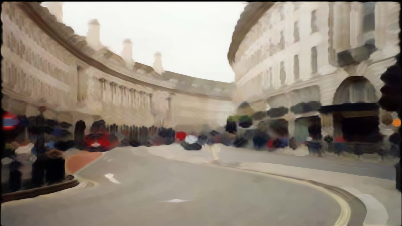

# Anisotropic Kuwahara Filter for Nuke's Blink Script Nodes

## Overview
This project implements the Anisotropic Kuwahara Filter in Nuke's Blink Script nodes. The filter is based on the concept presented in the original paper by Kyprianidis et al., and adapted from a GLSL implementation by [sofiene71](https://www.shadertoy.com/user/sofiene71) on ShaderToy.

Original Article: [Kyprianidis et al. - Anisotropic Kuwahara Filtering](https://www.kyprianidis.com/p/pg2009/)

GLSL Implementation Source: [ShaderToy - Anisotropic Kuwahara Filter](https://www.shadertoy.com/view/td3BzX)  
 
## Usage
The filter is implemented as a Blink Script node, and can be used like any other Blink Script node.

[Blink Script Documentation](https://learn.foundry.com/nuke/content/reference_guide/other_nodes/blinkscript.html)

The filter takes the following inputs:
- **radius** - sets a convolution radius
- **q** - controls sharpness of the output  
- **alpha** - a tuning parameter for adjusting  the eccentrucuty of ellipse used for the anisotropic filter
- **scale** - the  extent of filter's application affect
